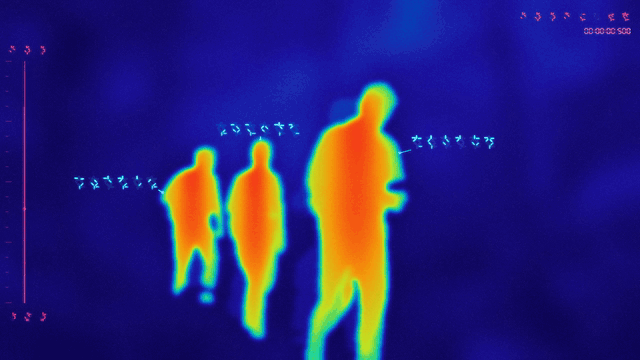
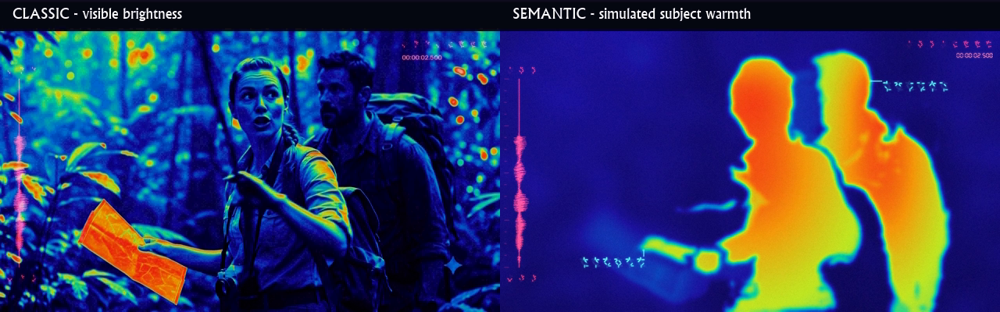

<p align="center">
  
</p>

<p align="center">
  <a href="https://github.com/petehottelet/yautja/releases/latest"></a>
  <a href="LICENSE"></a>
  
  
  <a href="SKILL.md"></a>
  <a href="#install-the-agent-skill"></a>
  <a href="https://github.com/petehottelet/yautja/actions/workflows/ci.yml"></a>
  <a href="https://yautja.ai"></a>
</p>

# Yautja is sci-fi segmentation, re-skinning, annotation

Yautja is a **sci-fi-styled image segmentation, re-skinning, and annotation skill** for creating thermal-imaging-style output.

**For entertainment purposes only.** Colors assigned during re-skinning are purely algorithmically generated, with some randomness. They do not represent measured temperatures.

Re-skin local video frames with cold blues, warm silhouettes, alien HUD glyphs, and an audio-reactive waveform. A portable **agent skill for Claude and OpenAI Codex**, with a standalone Python/FFmpeg CLI. [yautja.ai](https://yautja.ai).



A five-second loop from generated jungle-explorer footage, processed with semantic mode. Warm silhouettes suppress facial and clothing detail; shaded glyphs sit close to each target. The waveform follows the source audio. [Download the full 10-second demo with sound](https://github.com/petehottelet/yautja/releases/latest/download/yautja-demo.mp4) · [View a still frame](assets/preview.png) · [Download the promo GIF](https://github.com/petehottelet/yautja/releases/latest/download/yautja-promo.gif).

## Install the agent skill

```bash
npx skills add petehottelet/yautja --skill yautja --agent claude-code codex --global
```

Then ask: **“Use Yautja’s semantic mode to turn `clip.mp4` into smooth warm silhouettes against a cool background, with glyph callouts, timecode, and the original sound.”** The skill checks Python and FFmpeg before converting. Subject segmentation needs the separate semantic setup below.

Prefer a portable download? Get [yautja.zip from the latest release](https://github.com/petehottelet/yautja/releases/latest/download/yautja.zip). For a direct CLI checkout, follow Quick start below.

Silent videos use the smoothly generated waveform from the original effect.

## When to use Yautja

- Create a sci-fi thermal-imaging look or false-color treatment for MP4, MOV, MKV, or WebM footage.
- Segment people and selected animals, then re-skin them as warm silhouettes against cool surroundings.
- Annotate subjects with alien glyphs and add sound-driven waveform animation and optional elapsed timecode.
- Export a short preview or a complete local H.264/AAC MP4 while preserving aspect ratio and sound.

The effect uses image segmentation and synthetic color fields, with seeded random variation in the grain. It does not analyze infrared sensor data or provide identity/anonymity guarantees. Model files download explicitly; ordinary conversions process footage locally.

## Quick start

Install Python 3.10+ and [FFmpeg](https://ffmpeg.org/download.html) with ffprobe on PATH, then:

```bash
git clone https://github.com/petehottelet/yautja.git
cd yautja
python -m venv .venv
```

On macOS/Linux:

```bash
.venv/bin/python -m pip install -r requirements.txt
.venv/bin/python scripts/yautja.py --doctor
.venv/bin/python scripts/yautja.py "clip.mov" "outputs/clip-yautja.mp4" --timecode
```

On Windows:

```powershell
.venv\Scripts\python.exe -m pip install -r requirements.txt
.venv\Scripts\python.exe scripts/yautja.py --doctor
.venv\Scripts\python.exe scripts/yautja.py "clip.mov" "outputs/clip-yautja.mp4" --timecode
```

Leave off `--timecode` for the alien readout alone. Sound is retained unless `--mute` is used. Existing files are protected unless you explicitly pass `--overwrite`.

## Subject-based thermal mode

For warm silhouettes against cool surroundings, use the optional semantic mode. It detects people and selected animals, replaces their visible detail with smooth heat regions, and simulates a lower-resolution sensor before applying color. Bright foliage stays cool. `--verbose` adds broad segmented glyphs with dim outlines, shaded cyan highlights, and varied six-symbol combinations that stay stable as each target moves.



[View the three-second semantic animation](assets/semantic-preview.gif). Both examples use the same generated jungle footage. The semantic demo uses 1280×720, 24 fps with audio and verbose annotations. CPU/CUDA timings and precision comparisons are recorded in the [phase 1 validation report](references/phase1-validation.md).

```bash
python -m pip install -r requirements-semantic.txt
python scripts/yautja.py --download-models
python scripts/yautja.py "clip.mov" "outputs/clip-semantic.mp4" --thermal semantic --verbose --timecode
```

Run these with your virtual environment's Python. Models download once; subsequent conversions run locally from the cache. `--sensor-resolution 160` increases abstraction, `--warm-objects "person,dog,bird"` selects warm categories, and `--hot-objects "fire"` explicitly adds a hot category. Start with `--duration 5`, especially on CPU. The original effect remains the default `--thermal classic`.

Use `--doctor --thermal semantic --device cuda` to check the active environment, pinned model files, and an actual CUDA tensor operation without downloading anything. See the [isolated GPU setup](references/semantic.md#isolated-cuda-environment-on-windows). Conversion reports include actual device/precision, setup and processing time, inference time, and peak CUDA memory. Full precision remains the default; `--precision bf16` is experimental.

See [semantic setup, controls, and limitations](references/semantic.md). This is simulated warmth, not measured temperature. Grounding DINO and SAM 2.1 are Apache-2.0 dependencies; Yautja's code remains MIT. Models and runtime binaries are excluded from the skill archive. [Dependency licensing details](references/dependencies.md).

## Install as a skill

```bash
python scripts/package_skill.py --install both
```

This installs the portable skill files into `~/.claude/skills/yautja` and `~/.codex/skills/yautja` (respecting `CODEX_HOME`). Use `--install claude` or `--install codex` to install one. Existing installations are left alone unless you pass `--replace`. Start a new agent session after installing.

- **Claude Code:** ask “Use /yautja to convert this video, with timecode.”
- **Codex:** ask “Use $yautja to convert this video, without timecode.”
- **Claude skill upload:** build the portable archive with `python scripts/package_skill.py --zip dist/yautja.zip`, or download it from Releases. The runtime still needs Python dependencies and FFmpeg; availability depends on the Claude execution environment.

The same `SKILL.md` and implementation work for both agents. [Claude's skill documentation](https://code.claude.com/docs/en/skills) describes local skill installation. Runtime setup and codec troubleshooting are in [references/runtime.md](references/runtime.md).

### Updates

For the global installation made by the skills CLI:

```bash
npx skills update yautja --global
```

For a Git checkout installed with the bundled copier:

```bash
git pull --ff-only
python scripts/package_skill.py --install both --replace
```

Use the same installation method for updates. The copier replaces only the known runtime files; it leaves local environments and user files in place. Review requirement changes, rerun doctor with the installed environment's Python, and start a new agent session after updating. `python scripts/yautja.py --version` prints the installed version. See the [changelog](CHANGELOG.md) and [releases](https://github.com/petehottelet/yautja/releases) before upgrading. Conversion does not update the skill automatically.

## Useful controls

| Option | Behavior |
| --- | --- |
| `--timecode` / `--no-timecode` | LCD-style elapsed `HH:MM:SS.mmm`, on/off; default off |
| `--timecode-start 90` | Begin the displayed clock at 00:01:30.000 |
| `--waveform auto` | Use audio, or procedural motion for absent/silent audio |
| `--waveform procedural` | Force generated motion, keeping the soundtrack |
| `--waveform audio` | Require an audio track; silent samples produce a flat trace |
| `--wave-gain 1.5` | Increase audio waveform amplitude |
| `--wave-window 0.6` | Seconds represented along the vertical trace |
| `--audio-stream 1` | Use the second audio track for analysis and playback |
| `--mute` | Remove sound without disabling audio analysis |
| `--start 10 --duration 5` | Convert a five-second trim starting at ten seconds |
| `--max-size 1280 --fps 30` | Limit resolution and set output frame rate |
| `--grain 0 --glow 0.4` | Cleaner image with restrained HUD bloom |
| `--seed 123` | Reproducible generated waveform, grain, and callout glyph combinations |

Default output is H.264/AAC MP4, CRF 18, source aspect ratio and orientation, at most 1920 pixels on the longest edge, and source-average constant frame rate capped at 60 fps. It handles FFmpeg-decodable local videos; protected, corrupt, or unsupported media cannot be guaranteed. This is false-color video art, not a thermal sensor or temperature measurement.

## Development

```bash
python -m unittest discover -s tests -v
```

Tests include real FFmpeg conversions, silent/no-audio fallback, stereo phase cancellation, waveform timing, timecode, portrait/rotation/aspect handling, and output protection.

Semantic heat and tracking tests use deterministic masks and optional OpenCV, without downloading models. They check cool backgrounds, texture suppression, tracking and fading, scene cuts, and CLI validation. A real model render should also be checked when changing segmentation dependencies.

CI runs offline conversion and archive checks on Windows, macOS, and Linux, with Python 3.10/3.11 coverage. Dependabot opens weekly dependency-update PRs; model/runtime changes still need a cached-model render before merging. For a release, update `VERSION` and `CHANGELOG.md`, pass CI, and publish the matching `v` tag. The release workflow tests the tagged source and attaches `yautja.zip` plus `SHA256SUMS.txt` automatically.

For repeatable local performance comparisons, run these sequentially with each environment's Python. Use the same input and settings; the runner creates a new output directory for every invocation, records a source hash and exact commands, and verifies decoded frames and audio timing. It requires cached models and never downloads them.

```bash
python scripts/benchmark.py "clip.mov" --device cpu --runs 2
python scripts/benchmark.py "clip.mov" --device cuda --runs 2
python scripts/benchmark.py "clip.mov" --device cuda --precision bf16 --runs 2
python scripts/compare_precision.py "clip.mov" --times 0 2 4 6 8
```

Every benchmark run starts a fresh process and reloads models. Operating-system file caches are uncontrolled, so a first run is not necessarily cold. `compare_precision.py` compares sampled mask agreement; it does not establish detection accuracy. These developer tools stay in the repository, outside the portable skill manifest.

<details>
<summary>Regenerate the README preview</summary>

The demo source is kept locally in the ignored `00_project_files/` folder and is not included in a clone. With that clip available, run these commands using the semantic Python environment and cached models from Subject-based thermal mode:

```bash
python scripts/yautja.py "00_project_files/create_a_video_of_explorers_wa.mp4" "outputs/explorers-yautja.mp4" --thermal semantic --verbose --max-size 1280 --fps 24 --timecode --overwrite
ffmpeg -y -ss 0.5 -i "outputs/explorers-yautja.mp4" -t 5 -filter_complex "fps=12,scale=640:-1:flags=lanczos,split[frames][colors];[colors]palettegen=max_colors=128:stats_mode=diff[palette];[frames][palette]paletteuse=dither=bayer:bayer_scale=5:diff_mode=rectangle" -an -loop 0 "assets/preview.gif"
ffmpeg -y -ss 3 -i "outputs/explorers-yautja.mp4" -frames:v 1 "assets/preview.png"
```

The GIF uses seconds 0.5–5.5 at 640×360 and 12 fps, with a 128-color palette. These commands replace the generated previews; the source stays local.

</details>
