<p align="center">
  
</p>

<p align="center">
  <a href="https://github.com/petehottelet/yautja/releases/latest"></a>
  <a href="LICENSE"></a>
  
  
  <a href="SKILL.md"></a>
  <a href="#install-the-agent-skill"></a>
  <a href="https://github.com/petehottelet/yautja/actions/workflows/ci.yml"></a>
  <a href="https://yautja.ai"></a>
</p>

# Yautja is sci-fi segmentation, re-skinning, and annotation for video and images. 

Yautja is a **sci-fi-styled image segmentation, re-skinning, and annotation skill** for creating thermal-imaging-style output.

**For entertainment purposes only.** Colors assigned during re-skinning are purely algorithmically generated, with some randomness. They do not represent measured temperatures.

Re-skin local images and video frames with cold blues, warm silhouettes, and alien HUD glyphs. Videos add an audio-reactive waveform. A portable **agent skill for Claude and OpenAI Codex**, with a standalone Python CLI and FFmpeg for video. [yautja.ai](https://yautja.ai).

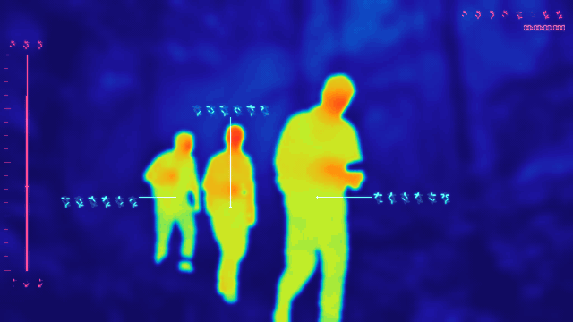

A three-second loop from generated jungle-explorer footage, using **Cinematic** detail and the **original Yautja palette**, with texture off. The waveform follows the source audio; GIFs are silent. [View a still frame](assets/examples/poster.png). The gallery and new controls below reflect the current source; the published 1.0 archive and [earlier demo with sound](https://github.com/petehottelet/yautja/releases/latest/download/yautja-demo.mp4) use the previous renderer.

## Install the agent skill

```bash
npx skills add petehottelet/yautja --skill yautja --agent claude-code codex --global
```

Then ask: **“Use Yautja’s Cinematic look with the original palette, glyph callouts, timecode, and the original sound. Keep the image clean.”** The skill checks Python and FFmpeg before converting. Subject segmentation needs the separate semantic setup below.

Prefer a portable download? Get [yautja.zip from the latest release](https://github.com/petehottelet/yautja/releases/latest/download/yautja.zip). For a direct CLI checkout, follow Quick start below.

Silent videos use the smoothly generated waveform from the original effect.

## When to use Yautja

- Create a sci-fi thermal-imaging look or false-color treatment for MP4, MOV, MKV, or WebM footage.
- Restyle JPEG/PNG images and export a PNG with the same anatomy-guided colors and glyph callouts.
- Segment people and selected animals, then re-skin them as warm silhouettes against cool surroundings.
- Annotate subjects with alien glyphs and add sound-driven waveform animation and optional elapsed timecode.
- Export a short preview or a complete local H.264/AAC MP4 while preserving aspect ratio and sound.

The effect uses image segmentation and synthetic color fields, with seeded variation and optional sensor grain. It does not analyze infrared sensor data or provide identity/anonymity guarantees. Model files download explicitly; ordinary conversions process footage locally.

## Quick start

Install Python 3.10+ and, for video, [FFmpeg](https://ffmpeg.org/download.html) with ffprobe on PATH, then:

```bash
git clone https://github.com/petehottelet/yautja.git
cd yautja
python -m venv .venv
```

On macOS/Linux:

```bash
.venv/bin/python -m pip install -r requirements.txt
.venv/bin/python scripts/yautja.py --doctor
.venv/bin/python scripts/yautja.py "clip.mov" "outputs/clip-yautja.mp4" --timecode
```

On Windows:

```powershell
.venv\Scripts\python.exe -m pip install -r requirements.txt
.venv\Scripts\python.exe scripts/yautja.py --doctor
.venv\Scripts\python.exe scripts/yautja.py "clip.mov" "outputs/clip-yautja.mp4" --timecode
```

Leave off `--timecode` for the alien readout alone. Sound is retained unless `--mute` is used. Existing files are protected unless you explicitly pass `--overwrite`.

### Still images

JPEG and PNG inputs save directly to PNG. The current source includes still-image support; it is not included in the published 1.0 archive yet. With the Python requirements installed:

```bash
python scripts/yautja.py --doctor --media image
python scripts/yautja.py "photo.jpg" "outputs/photo-yautja.png"
# After the semantic setup below, use anatomy coloring and glyph callouts:
python scripts/yautja.py "photo.jpg" "outputs/photo-semantic.png" --thermal semantic --verbose
```

Use your virtual environment's Python. PNG output selects still-image mode automatically; FFmpeg is not needed. The same renderer supplies the chosen look, palette, optional grain/pixelation, shaded glyphs, and a static procedural waveform. All three segmented looks work with still images. `--timecode` optionally displays a static clock at `--timecode-start` (zero by default).

Images retain their aspect ratio and EXIF orientation, with a longest edge of at most 1920 pixels and no upscaling. `--max-size` changes that limit. Transparent areas are flattened onto black before coloring; output is an RGB PNG without source metadata. Animated PNG and video-only timing/audio controls are rejected. Existing output and source files are protected.

## Three thermal looks

Choose the level of detail separately from the color palette. All three examples use the **original Yautja colors**, with grain, pixelation, and scanlines off.

| Silhouette | Cinematic | Detailed |
| --- | --- | --- |
| 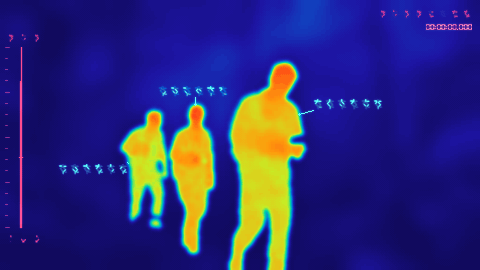 |  | 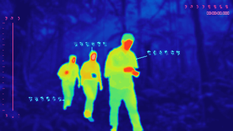 |
| Soft, blobby subjects and an abstract background—the older semantic look. | The middle ground: broad heat patches, some skin/gear separation, and softer edges. | Distinct skin, clothing, hair, and equipment, with restrained garment shading and more scenery detail. |
| `--thermal silhouette` | `--thermal cinematic` | `--thermal detailed` |

All three use anatomy-guided fallback when estimates are uncertain. Cinematic and Detailed reuse the same models for extra surface segmentation; they take longer as the number of people increases. Small objects, distant hands, eyewear, and overlaps can still be missed or misclassified. These are generated visual effects, not measured temperatures or material properties.

Existing commands still work: `--thermal semantic` is an alias for Silhouette, and `--thermal realistic` is an alias for Detailed. The lightweight `--thermal classic` luminance filter remains the no-flag CLI default; it does not segment subjects.

### Color palettes

**Yautja is the default for every look.** The new palettes are optional. All examples below use Cinematic with identical segmentation and no added texture.

| Redline · red, blue, and black | Virtual Boy · red only |
| --- | --- |
| 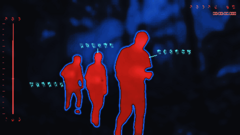 | 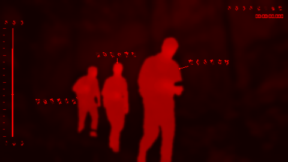 |
| `--palette redline` | `--palette virtualboy` |

Redline gives the movie-style red/blue/black treatment, with broad red warmth and small pink highlights. Virtual Boy uses only red and black, including the glyphs, waveform, and timecode.

| Yautja · original/default | Ironbow | Green Phosphor |
| --- | --- | --- |
|  | 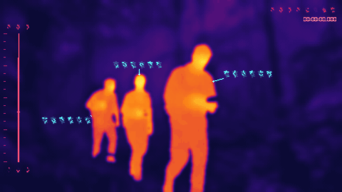 | 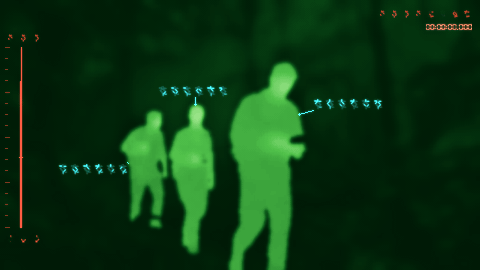 |
| `--palette yautja` | `--palette ironbow` | `--palette green-phosphor` |

| Amber Phosphor | White Hot | Black Hot |
| --- | --- | --- |
| 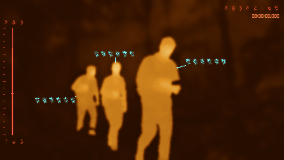 | 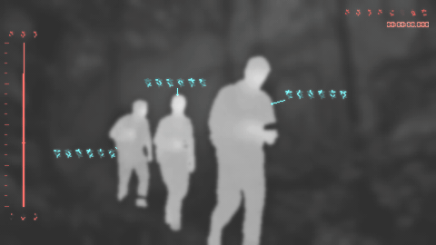 | 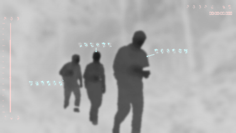 |
| `--palette amber-phosphor` | `--palette white-hot` | `--palette black-hot` |

`--palette auto` also selects the original Yautja palette. Changing the level of detail never changes the palette automatically. Phosphor palettes are display styles, not a low-light recovery feature.

### Grain and chunky pixels

Every effect is **optional and off by default**. Add grain, chunky pixels, CRT lines, or VHS styling independently, or combine them. The heat field, glyph selection, and audio behavior stay the same.

| Clean · default | Grain only | Chunky pixels only |
| --- | --- | --- |
|  | 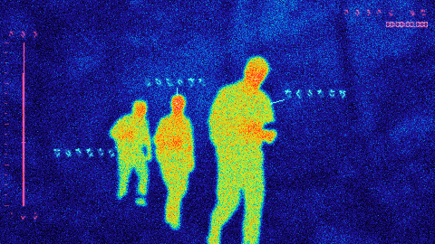 |  |
| No texture flags | `--grain 0.06` | `--pixelation 80` |

| CRT Lines only | Sensor texture · combined preset |
| --- | --- |
| 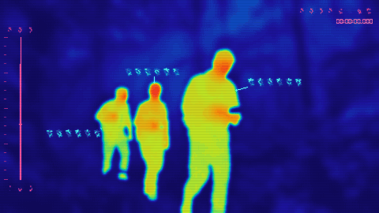 |  |
| `--crt-lines` | `--sensor-texture` |

| VHS only | VHS + CRT Lines |
| --- | --- |
|  |  |
| `--vhs` | `--vhs --crt-lines` |

Bare `--grain` uses strength 0.035; the example above uses a stronger 0.06 so it is easy to see. `--grain 0` disables noise. Bare `--pixelation` uses a longest grid edge of 96; lower values make larger blocks (range 32–640), and `--pixelation 0` disables it. Pixelation changes the display, not the segmentation resolution. `--no-crt-lines` disables CRT lines; the older `--scanlines` / `--no-scanlines` flags are aliases.

VHS adds softer color detail, chroma bleed, slight horizontal wobble, tape noise, and occasional dropouts and tracking defects across the finished picture, including the HUD. It animates in video; still images receive a fixed frame of the effect. `--no-vhs` disables it. It does not alter the soundtrack or invent thermal detail. CRT lines can be used with or without VHS.

The combined sensor preset adds grain 0.035, a grid at `--sensor-resolution` (default 256), CRT lines, and light intensity quantization. It does not enable VHS. Individual settings override the corresponding preset components. `--no-sensor-texture` disables the preset while preserving explicitly enabled effects. For completely clean output, omit the effects or use `--no-sensor-texture --grain 0 --pixelation 0 --no-crt-lines --no-vhs`.

```bash
python scripts/yautja.py "clip.mov" "outputs/clip-cinematic.mp4" --thermal cinematic --verbose --timecode
python scripts/yautja.py "photo.jpg" "outputs/photo-detailed.png" --thermal detailed --palette ironbow --verbose
python scripts/yautja.py "clip.mov" "outputs/clip-phosphor.mp4" --thermal cinematic --palette green-phosphor --grain 0.03 --pixelation 96
python scripts/yautja.py "clip.mov" "outputs/clip-vhs.mp4" --thermal cinematic --palette redline --vhs --crt-lines
python scripts/yautja.py "clip.mov" "outputs/clip-virtualboy.mp4" --thermal silhouette --palette virtualboy
```

All comparison GIFs use the same three-second slice, 480×270 at 12 fps, with the original audio driving the waveform. The hero uses 640×360. They compare styling choices, not model accuracy. The source footage stays local.

### Segmentation setup

Install the optional requirements in your virtual environment and explicitly download the pinned models once:

```bash
python -m pip install -r requirements-semantic.txt
python scripts/yautja.py --download-models
python scripts/yautja.py --doctor --thermal cinematic --device cuda
python scripts/yautja.py "clip.mov" "outputs/clip-cinematic.mp4" --thermal cinematic --verbose --timecode
```

Use your environment's Python. Grounding DINO, SAM 2.1, and ViTPose are shared by all three looks, and conversions use cached weights only. `--device auto` chooses available CUDA or CPU; CPU is slower. Start with a short `--duration 5` sample. See [setup, controls, and limitations](references/semantic.md) and the [isolated GPU setup](references/semantic.md#isolated-cuda-environment-on-windows).

`--sensor-resolution 160` increases heat-field abstraction, `--warm-objects "person,dog,bird"` selects warm categories, and `--hot-objects "fire"` explicitly adds an artistic hot category. Reports include the actual device, precision, timings, model revisions, and resolved effects. Full precision is the default; `--precision bf16` is experimental. [Earlier CPU/CUDA validation](references/phase1-validation.md).

Yautja's code is MIT; the separately installed models retain their Apache-2.0 licenses. Model weights, runtime binaries, and gallery GIFs are excluded from the portable skill archive. [Dependency licensing details](references/dependencies.md).

## Install as a skill

```bash
python scripts/package_skill.py --install both
```

This installs the portable skill files into `~/.claude/skills/yautja` and `~/.codex/skills/yautja` (respecting `CODEX_HOME`). Use `--install claude` or `--install codex` to install one. Existing installations are left alone unless you pass `--replace`. Start a new agent session after installing.

- **Claude Code:** ask “Use /yautja to convert this video, with timecode.”
- **Codex:** ask “Use $yautja to convert this video, without timecode.”
- **Claude skill upload:** build the portable archive with `python scripts/package_skill.py --zip dist/yautja.zip`, or download it from Releases. The runtime still needs Python dependencies and FFmpeg; availability depends on the Claude execution environment.

The same `SKILL.md` and implementation work for both agents. [Claude's skill documentation](https://code.claude.com/docs/en/skills) describes local skill installation. Runtime setup and codec troubleshooting are in [references/runtime.md](references/runtime.md).

### Updates

For the global installation made by the skills CLI:

```bash
npx skills update yautja --global
```

For a Git checkout installed with the bundled copier:

```bash
git pull --ff-only
python scripts/package_skill.py --install both --replace
```

Use the same installation method for updates. The copier replaces only the known runtime files; it leaves local environments and user files in place. Review requirement changes, rerun doctor with the installed environment's Python, and start a new agent session after updating. `python scripts/yautja.py --version` prints the installed version. See the [changelog](CHANGELOG.md) and [releases](https://github.com/petehottelet/yautja/releases) before upgrading. Conversion does not update the skill automatically.

## Useful controls

| Option | Behavior |
| --- | --- |
| `--timecode` / `--no-timecode` | LCD-style elapsed `HH:MM:SS.mmm`, on/off; default off |
| `--timecode-start 90` | Begin the displayed clock at 00:01:30.000 |
| `--waveform auto` | Use audio, or procedural motion for absent/silent audio |
| `--waveform procedural` | Force generated motion, keeping the soundtrack |
| `--waveform audio` | Require an audio track; silent samples produce a flat trace |
| `--wave-gain 1.5` | Increase audio waveform amplitude |
| `--wave-window 0.6` | Seconds represented along the vertical trace |
| `--audio-stream 1` | Use the second audio track for analysis and playback |
| `--mute` | Remove sound without disabling audio analysis |
| `--start 10 --duration 5` | Convert a five-second trim starting at ten seconds |
| `--max-size 1280 --fps 30` | Limit resolution and set output frame rate |
| `--grain 0.02` | Add fine grain independently; 0 disables |
| `--pixelation 80` | Add chunky pixels independently; smaller grids make larger blocks |
| `--crt-lines` / `--no-crt-lines` | Toggle horizontal CRT lines, including across the HUD |
| `--vhs` / `--no-vhs` | Toggle analog tape styling and defects |
| `--sensor-texture` / `--no-sensor-texture` | Toggle the combined preset; individual effects override its defaults |
| `--palette green-phosphor` | Choose a palette independently of thermal detail |
| `--glow 0.4` | Restrain HUD bloom independently of sensor texture |
| `--seed 123` | Reproducible generated waveform, grain, and callout glyph combinations |

Video output is H.264/AAC MP4, CRF 18, source aspect ratio and orientation, at most 1920 pixels on the longest edge, and source-average constant frame rate capped at 60 fps. Image output is RGB PNG. It handles local JPEG/PNG stills and FFmpeg-decodable videos; protected, corrupt, or unsupported media cannot be guaranteed. Colors are simulated and do not measure temperature.

## Development

```bash
python -m unittest discover -s tests -v
```

Tests include JPEG/PNG conversion without FFmpeg, EXIF orientation, transparency, deterministic stills, output protection, and real FFmpeg conversions with audio timing, timecode, and aspect handling.

Semantic heat and tracking tests use deterministic masks and optional OpenCV, without downloading models. They check cool backgrounds, texture suppression, tracking and fading, scene cuts, and CLI validation. A real model render should also be checked when changing segmentation dependencies.

CI runs offline conversion and archive checks on Windows, macOS, and Linux, with Python 3.10/3.11 coverage. Dependabot opens weekly dependency-update PRs; model/runtime changes still need a cached-model render before merging. For a release, update `VERSION` and `CHANGELOG.md`, pass CI, and publish the matching `v` tag. The release workflow tests the tagged source and attaches `yautja.zip` plus `SHA256SUMS.txt` automatically.

For repeatable local performance comparisons, run these sequentially with each environment's Python. Use the same input and settings; the runner creates a new output directory for every invocation, records a source hash and exact commands, and verifies decoded frames and audio timing. It requires cached models and never downloads them.

```bash
python scripts/benchmark.py "clip.mov" --device cpu --runs 2
python scripts/benchmark.py "clip.mov" --device cuda --runs 2
python scripts/benchmark.py "clip.mov" --device cuda --precision bf16 --runs 2
python scripts/compare_precision.py "clip.mov" --times 0 2 4 6 8
```

Every benchmark run starts a fresh process and reloads models. Operating-system file caches are uncontrolled, so a first run is not necessarily cold. `compare_precision.py` compares sampled mask agreement; it does not establish detection accuracy. These developer tools stay in the repository, outside the portable skill manifest.

<details>
<summary>Regenerate the labelled README GIF gallery</summary>

The generated demo source is kept locally in the ignored `00_project_files/` folder and is not included in a clone. With the semantic environment and cached models ready:

```bash
python scripts/build_gallery.py "00_project_files/create_a_video_of_explorers_wa.mp4" --device cuda --overwrite
```

The builder processes seconds 0.5–3.5 once, shares tracked masks and heat fields across matched variants, and exports all labelled examples into `assets/examples/`. It applies texture at the final display size so GIF downsampling does not erase grain or scanlines. It verifies animation timing before replacing the GIFs. The source and temporary decoded frames are never included in the skill archive. The helper is for short SDR gallery clips; use the main converter for normal images and videos.

</details>
